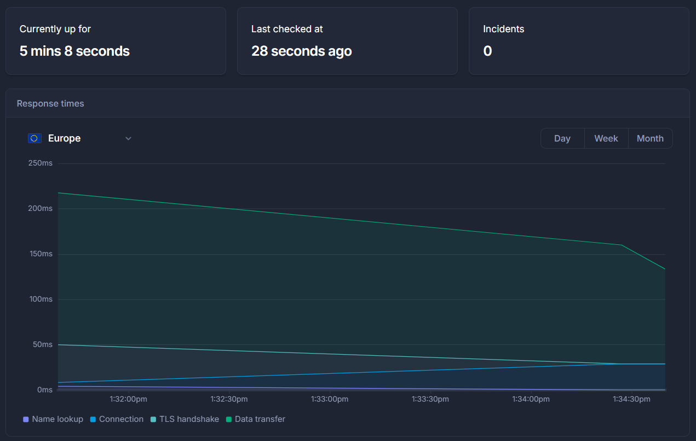

# Digits Recognition

This is a simple digit classifier project made for a course in software engineering for AI-enabled systems.

## Table of Contents

1. [ML Canvas](#ml-canvas)
2. [Cookiecutter](#cookiecutter)
3. [DVC](#dvc)
4. [DagsHub](#dagshub)
5. [MLflow](#mlflow)
6. [Quality Assurance](#quality-assurance)
7. [APIs](#apis)
8. [Dataset & Model Cards](#dataset--model-cards)
9. [Docker](#docker)
10. [GitHub Actions](#github-actions)
11. [Monitoring](#monitoring)

--------

## ML Canvas

- [ML canvas](canvas.md)

--------

## Cookiecutter

This repository makes use of the CCDS project template for its directory organization.

--------

## DVC

The entire machine learning pipeline, from preprocessing to evaluation, has been turned into a DAG (Directed Acyclic Graph) whose nodes are DVC stages that [track files](dvc.yaml) and their [modifications](dvc.lock).

Arguments of the scripts executed during the pipeline are grouped [here](params.yaml).

--------

## DagsHub

This repository is mirrored on [DagsHub](https://dagshub.com/GianmarcoTurchiano/Digits-Recognition), onto which [dataset](data/) and [model](models/) files are tracked (otherwise ignored on [GitHub](https://github.com/GianmarcoTurchiano/Digits-Recognition/)), along with experiment logs.

--------

## MLflow

Train and evaluation procedures log metrics and parameters to the [MLflow services provided by DagsHub](https://dagshub.com/GianmarcoTurchiano/Digits-Recognition.mlflow/). Runs are divided into experiments, which signify the use of different architectures.

Additionally, the trained models have been tracked as artifacts. After evaluation, when results were particularly promising, models were manually added to the [model registry](https://dagshub.com/GianmarcoTurchiano/Digits-Recognition.mlflow/).

--------

## Quality Assurance

Pylint and Flake8 were used for the static analysis of the code.

Great Expectations was used to validate the size of the pictures and the range of labels in the dataset (see the [check stage of the pipeline](digits_recognition/experimentation/dataset/check.py)).

Pytest was employed for the following:

- [Functional Tests](digits_recognition/experimentation/modeling/tests/functional_tests)
    - Tests that verify the functional correctness of the training and evaluation procedures, before they are actually executed.
- [Behavioral Tests](digits_recognition/experimentation/modeling/tests/behavioral_tests/)
    - Multiple invariance tests verify that there is low variance between the predictions on original and transformed pictures.
    - A minimum functionality test verifies that the model performs well on digits written using well-known fonts.

--------

## APIs

FastAPI was used to implement [HTTP endpoints](digits_recognition/api/endpoints.py) that preprocess a picture of any size (even in color) to classify each of the digits represented within its pixels.

There are three POST endpoints. The first two endpoints, `/predictions` and `/probabilities`, both return a map where keys are `[x, y]` coordinates within the input pictures that correspond respectively to a label or a probability distribution. The third endpoint, `/annotations`, returns the input pictures with annotated predicted labels.

The APIs load the classifier directly from MLflow's [model registry](https://dagshub.com/GianmarcoTurchiano/Digits-Recognition.mlflow/#/models/GiaNet).

[API endpoints were also tested using Pytest](digits_recognition/api/tests/test_endpoints.py).

--------

## Dataset & Model Cards

- [Dataset Card](data/readme.md)
- [Model Card](models/readme.md)

--------

## Docker

The APIs have been [dockerized](dockerfile) and then [composed with Prometheus and Grafana containers](docker-compose.yml).

--------

## GitHub Actions

A [job](.github/workflows/qa.yaml) that runs upon the opening of a pull request has been defined. This executes the linting macro (`make lint`) that makes use of Flake8 and Pylint.

--------

## Monitoring

CodeCarbon was used to [log carbon emissions during train and test runs](emissions.csv).

Locust can be used to [stress test the server hosting the APIs](locustfile.py).

Prometheus was set up to [log standard FastAPI metrics](digits_recognition/api/monitoring.py).

A Grafana dashboard was created to display some of those metrics.

The APIs were deployed, and their uptime was tracked with Better Uptime.

Data drift between the train set and the test set is checked in the [drift stage of the pipeline](digits_recognition/experimentation/dataset/drift.py) with a Kolmogorov-Smirnov test (Alibi Detect implementation) on the normalized pixel features.
